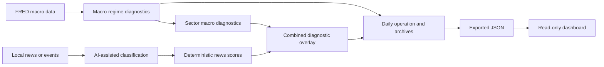

# Project Handoff: Macro Regime Identifier

Last updated: 2026-05-23

## 1. Handoff Summary

This repository contains a local-first macro, sector, and news diagnostic
platform with a read-only dashboard.

Current software state:

```text
v1.0-rc1  Full-system diagnostic platform release candidate
v1.1-M1   Real daily operations trial passed
v1.1-M2   Source coverage improvement passed
```

Latest committed revision at handoff:

```text
commit: 7e218ba
message: Run v1.1 operations trial and improve source coverage
branch: master
tags: v1.0-rc1, v1.1-m1-pass, v1.1-m2-pass
```

Repository and deployed dashboard:

- Source repository: [riperdy-tech/Macro-Regime-Identifier](https://github.com/riperdy-tech/Macro-Regime-Identifier)
- GitHub Pages dashboard: [Macro Diagnostic Dashboard](https://riperdy-tech.github.io/Macro-Regime-Identifier/)

The platform is ready for local diagnostic operation. It is not performance
validated. Its current operating-readiness label remains:

```text
insufficient_history
```

## 2. What The Program Does

The platform gathers macroeconomic data and local news/event text, turns those
inputs into structured diagnostic reports, and shows the reports in a dashboard.

The workflow is:



In plain terms:

1. The macro engine reads configured FRED series and reports the current macro
   regime, such as `reflation`.
2. The sector layer reports how the macro state relates to broad sector
   diagnostics.
3. The news layer ingests news text and uses AI to label themes and sector
   impacts in structured form.
4. Python code aggregates those labels into news diagnostics and a bounded
   combined sector overlay.
5. The daily command archives reports and updates operating history.
6. The dashboard displays exported backend results.

## 3. What The Program Does Not Do

This boundary must be preserved after migration.

The platform does not:

- place orders;
- choose securities;
- size holdings;
- call AI from the dashboard;
- calculate scores in the dashboard;
- prove predictive performance;
- provide investment advice.

Historical replay is an operating workflow check. It is not a predictive
backtest. Macro history uses revised FRED data unless a separate vintage-data
system is implemented later.

## 4. Technology Stack

Backend:

```text
Python >= 3.11
DuckDB
pandas / numpy
Pydantic
Typer CLI
PyYAML
requests
python-dotenv
pytest / ruff
```

Package metadata:

```text
project package version: 1.0rc1
display version: v1.0-rc1
```

Frontend:

```text
Vite
React 19
TypeScript
Node.js / npm
```

External services:

```text
FRED API for macro inputs
DeepSeek OpenAI-compatible API for optional live AI news classification
GitHub Pages for static dashboard deployment
```

## 5. Repository Layout

Important tracked paths:

```text
config/                       Backend and operating configuration
dashboard/                    Read-only React dashboard
data/examples/                Safe synthetic fixture data
docs/                         Reviews, runbooks, checklists, this handoff
scripts/                      Daily-operation shell scripts
src/macro_engine/             Python application source
tests/                        Backend and dashboard-export tests
.github/workflows/pages.yml   Dashboard deployment workflow
.env.example                  Secret/environment template only
README.md                     User-facing project documentation
pyproject.toml                Python package and tooling configuration
```

Important backend modules:

```text
src/macro_engine/cli.py                 CLI entrypoint
src/macro_engine/pipeline.py            Macro workflow
src/macro_engine/daily.py               Daily diagnostic orchestration
src/macro_engine/replay.py              Historical operating replay
src/macro_engine/dashboard_export.py    Dashboard JSON export
src/macro_engine/accumulation.py        News accumulation reporting
src/macro_engine/news/                  News ingestion/classification/scoring
src/macro_engine/sectors/               Sector diagnostic layer
src/macro_engine/storage/duckdb_store.py Local database storage
```

Core config files:

```text
config/phase_b_sources.yaml             Macro source configuration
config/dimensions.yaml                  Macro dimensions
config/regimes.yaml                     Macro regimes
config/sectors.yaml                     Sector taxonomy
config/sector_exposures.yaml            Sector assumptions
config/sector_regime_priors.yaml        Sector regime priors
config/news_sources.yaml                News source profiles
config/news_themes.yaml                 News classification themes
config/news_ai.yaml                     Mock-safe AI classification config
config/news_scoring.yaml                Deterministic news aggregation
config/sector_news_integration.yaml     Bounded combined overlay
config/news_monitoring.yaml             Input/classification/overlay checks
config/news_source_watchlist.yaml       Source-group coverage monitoring
config/news_accumulation.yaml           History accumulation tracking
config/daily_pipeline.yaml              Default mock-safe daily workflow
```

## 6. Tracked Versus Local-Only Files

This is the most important migration detail.

### Safe To Clone From Git

These should come across when the repository is cloned:

```text
source code
configuration
documentation
tests
dashboard source
dashboard/public/sample-data/
data/examples/sample_news_items.csv
GitHub workflow files
```

### Not Stored In Git

These paths are intentionally ignored and will not arrive in a normal clone:

```text
.env
data/news_pilot/
data/*.duckdb
data/**/*.duckdb
data/**/*.parquet
outputs/
outputs/archive/
outputs/replay/
dashboard/public/data/
dashboard/node_modules/
dashboard/dist/
logs/
.claude/
```

If migration must preserve real operating history, transfer the required
local-only artifacts through a secure private channel, separately from Git:

```text
data/macro_engine.duckdb               Stored run/classification/history state
data/news_pilot/*.csv                  Local mapped real-news input files
outputs/archive/                       Archived operating report packages
outputs/replay/                        Replay summaries, if needed
```

Generated dashboard exports do not need to be migrated; they can be regenerated
after backend outputs are restored:

```powershell
python -m macro_engine.cli export-dashboard-data
```

## 7. Secrets And Security Handoff

Never commit secrets or include them in documentation.

Create `.env` from the template:

```powershell
Copy-Item .env.example .env
```

Required/optional environment values:

```text
FRED_API_KEY=                 Required for live macro ingestion
DEEPSEEK_API_KEY=             Required only for live AI classification
DEEPSEEK_MODEL=deepseek-v4-flash
MACRO_ENGINE_DB_PATH=data/macro_engine.duckdb
MACRO_ENGINE_OUTPUT_DIR=outputs
MACRO_ENGINE_CONFIG=config/phase_b_sources.yaml
```

Migration security checklist:

1. Do not transfer `.env` through Git.
2. Set new secrets directly on the destination machine or in its secret store.
3. Rotate any API key that has previously been pasted into chat, logs, or an
   insecure transfer channel.
4. Confirm `git status --short` does not show `.env`, local DB files, real data,
   or generated outputs before committing.
5. The dashboard must never receive API keys; it reads exported JSON only.

## 8. New Machine Setup

### Backend Setup On Windows

```powershell
git clone https://github.com/riperdy-tech/Macro-Regime-Identifier.git
cd Macro-Regime-Identifier
python -m venv .venv
.\.venv\Scripts\Activate.ps1
pip install -e ".[dev]"
Copy-Item .env.example .env
```

Fill in the local `.env` values required for the intended operating mode.

### Backend Setup On macOS Or Linux

```bash
git clone https://github.com/riperdy-tech/Macro-Regime-Identifier.git
cd Macro-Regime-Identifier
python -m venv .venv
source .venv/bin/activate
pip install -e ".[dev]"
cp .env.example .env
```

### Frontend Setup

```powershell
cd dashboard
npm install
npm run build
```

Recommended Node version for deployment compatibility:

```text
Node.js 22
```

## 9. Restore Optional Local History

Skip this section for a fresh operation-only install.

To retain existing local operating history:

1. Restore `data/macro_engine.duckdb` to the destination project.
2. Restore desired mapped input files under `data/news_pilot/`.
3. Optionally restore `outputs/archive/` if old archived report packages should
   remain browsable.
4. Do not add any restored local-only file to Git.
5. Regenerate current report/export state after restoration.

Useful real-news files from the existing local machine include:

```text
data/news_pilot/news_items_balanced.csv
data/news_pilot/news_items_last_30_days.csv
data/news_pilot/daily_pipeline_expanded_live.yaml
data/news_pilot/news_ai_live_retry.yaml
```

These are local operational files, not committed project fixtures.

## 10. Verify A Fresh Installation

Run from repository root:

```powershell
python -m pytest
python -m ruff check .
python -m macro_engine.cli validate-config
```

Last validated result before handoff:

```text
pytest: 171 passed, 2 skipped
ruff: passed
validate-config: passed; 13 sources, 11 dimensions, 6 regimes
dashboard build: passed
guardrail scan: passed
```

Mock-safe daily smoke run:

```powershell
python -m macro_engine.cli run-daily-diagnostic --config config/daily_pipeline.yaml --mock-ai --archive
python -m macro_engine.cli export-dashboard-data
```

Dashboard build:

```powershell
cd dashboard
npm run build
```

## 11. Standard Operating Workflows

### Macro Workflow

```powershell
python -m macro_engine.cli run-pipeline --config config/phase_b_sources.yaml
python -m macro_engine.cli current-regime
python -m macro_engine.cli write-current-report --config config/phase_b_sources.yaml
```

### Sector Diagnostic Workflow

```powershell
python -m macro_engine.cli build-sector-scores --config config/phase_b_sources.yaml
python -m macro_engine.cli current-sector-ranking
python -m macro_engine.cli write-sector-report --config config/phase_b_sources.yaml
```

### News Workflow

Mock-safe:

```powershell
python -m macro_engine.cli ingest-news --config config/news_sources.yaml
python -m macro_engine.cli classify-news --config config/news_ai.yaml
python -m macro_engine.cli build-news-scores --config config/news_scoring.yaml
python -m macro_engine.cli write-news-score-report --config config/news_scoring.yaml
```

Live classification must use an intentional local config and a local secret.
Live daily runs are designed to be bounded and resumable:

```text
max live items per run
only unclassified items by default
progress output
incremental stored results
bounded timeout/retry behavior
```

### Daily Operating Workflow

Default mock-safe operation:

```powershell
python -m macro_engine.cli run-daily-diagnostic --config config/daily_pipeline.yaml --mock-ai --archive
python -m macro_engine.cli export-dashboard-data
```

The local v1.1 real-operation command used before handoff was:

```powershell
python -m macro_engine.cli run-daily-diagnostic --config data/news_pilot/daily_pipeline_expanded_live.yaml --source-profile last_30_days_local_csv --live-ai --archive
```

That command depends on local-only files and a local DeepSeek key.

### Accumulation And Monitoring

```powershell
python -m macro_engine.cli run-news-accumulation --config config/news_accumulation.yaml
python -m macro_engine.cli write-news-accumulation-report --config config/news_accumulation.yaml
python -m macro_engine.cli write-news-monitoring-report --config config/news_monitoring.yaml
python -m macro_engine.cli write-news-source-coverage-report --config config/news_source_watchlist.yaml
python -m macro_engine.cli export-dashboard-data
```

### Historical Operating Replay

```powershell
python -m macro_engine.cli replay-news-history --config config/daily_pipeline.yaml --news-file data/news_pilot/news_items_last_30_days.csv --start-date 2026-04-22 --end-date 2026-05-21 --archive --max-items-per-replay-day 10 --mock-ai
```

The input CSV is local-only. Replay should remain described as operating replay,
not predictive validation.

## 12. Dashboard Operation

The dashboard is located under:

```text
dashboard/
```

It reads generated JSON exported from backend outputs:

```text
outputs/ -> export-dashboard-data -> dashboard/public/data/ -> React dashboard
```

Refresh and run locally:

```powershell
python -m macro_engine.cli export-dashboard-data
cd dashboard
npm run dev
```

Visible pages:

```text
Overview
Macro
Sectors
News
Combined
Monitoring
History
```

If generated dashboard data is unavailable, the UI falls back to committed
synthetic sample fixtures under:

```text
dashboard/public/sample-data/
```

Dashboard rules:

- It is read-only.
- It must not contain API keys.
- It must not call AI services.
- It must not calculate backend scores.

## 13. GitHub Pages Deployment

Deployment workflow:

```text
.github/workflows/pages.yml
```

Current behavior:

1. A push to `master` affecting `dashboard/**` or the workflow triggers a build.
2. GitHub Actions installs dashboard dependencies with Node.js 22.
3. Vite builds `dashboard/dist`.
4. The workflow publishes the static build to the `gh-pages` branch.

The deployed public dashboard uses committed sample fixtures. It does not
publish local real-news files, databases, archives, API keys, or local exported
JSON.

When transferring to a different GitHub repository or owner:

1. Update the git remote.
2. Check `dashboard/vite.config.ts` for the GitHub Pages base path.
3. Enable GitHub Actions permissions needed by the Pages workflow.
4. Trigger the workflow after the destination repository is configured.
5. Verify the resulting Pages URL loads the dashboard.

## 14. Current Operating Snapshot

Snapshot from the last v1.1 operating review:

```text
latest recorded daily run date: 2026-05-22
latest macro date: 2026-05-01
reported macro regime: reflation
macro confidence: approximately 7.18%

top sector macro diagnostics:
1. energy
2. materials
3. industrials

latest news score date: 2026-05-21
top news themes:
1. monetary_tightening
2. commodity_pressure
3. growth_slowdown

top combined sectors:
1. energy
2. materials
3. industrials
4. consumer_staples
5. financials
```

Real-news operations snapshot:

```text
new bounded live run: 25 selected / 25 successful / 0 failed
accumulated classified items: 166
stored raw news items: 270
source group count: 12
unmapped item percentage: 0.0%
old item percentage: 6.3%
readiness label: insufficient_history
```

Remaining operating concerns:

```text
several source groups need fresher items
RSS-derived snippets can be short
real daily runs do not yet span enough separate dates
predictive validation must remain deferred
```

## 15. Important Reviews And Runbooks

Start with:

```text
README.md
docs/model_limitations.md
docs/operations/daily_runbook.md
docs/operations/dashboard_runbook.md
docs/reviews/phase_v10_m2_release_hardening.md
docs/reviews/phase_v11_m1_real_daily_operations_trial.md
docs/reviews/phase_v11_m2_source_coverage_improvement.md
docs/release_checklist_v1_0.md
```

These documents describe the frozen v1.0 release position and the first v1.1
operating work.

## 16. Recommended Next Work

The next maintainer should not begin by changing formulas or adding more UI.

Recommended direction:

```text
v1.1-M3: continued real daily runs and freshness review
```

Objectives:

1. Run bounded live daily diagnostics across separate real calendar/trading
   dates.
2. Improve fresh coverage for thin/stale source groups.
3. Monitor classification success, retry, and repair rates.
4. Keep exporting dashboard history after each operating run.
5. Preserve the current scoring formulas until enough real history exists.

Readiness thresholds currently used:

```text
insufficient_history  fewer than 5 real run dates or fewer than 100 classified items
early_history         5 to 20 real run dates
monitor_ready         20+ real run dates with reasonable source coverage
validation_candidate  60+ real run dates with stable source coverage
```

Despite exceeding 100 classified items locally, the platform is still marked
`insufficient_history` because repeated real daily date coverage is not mature
enough.

## 17. Migration Completion Checklist

Repository transfer:

- [ ] Clone or mirror the Git repository.
- [ ] Confirm tags including `v1.0-rc1` and `v1.1-m2-pass` exist.
- [ ] Confirm the dashboard Pages workflow is configured for the destination.

Environment:

- [ ] Install Python dependencies.
- [ ] Install dashboard npm dependencies.
- [ ] Create local `.env`.
- [ ] Set fresh API secrets locally.
- [ ] Rotate any previously exposed API secrets.

Optional local history:

- [ ] Securely transfer the DuckDB file only if existing history must be kept.
- [ ] Securely transfer local mapped news files only if required.
- [ ] Keep all real data and generated outputs unstaged.

Verification:

- [ ] Run `python -m pytest`.
- [ ] Run `python -m ruff check .`.
- [ ] Run `python -m macro_engine.cli validate-config`.
- [ ] Run a mock-safe daily diagnostic.
- [ ] Export dashboard data.
- [ ] Build and open the dashboard.

Operating boundary:

- [ ] Keep the dashboard read-only.
- [ ] Keep secrets outside tracked files.
- [ ] Keep real data and generated history local-only.
- [ ] Continue describing outputs as diagnostics until sufficient evidence
      exists for a separate validation phase.
